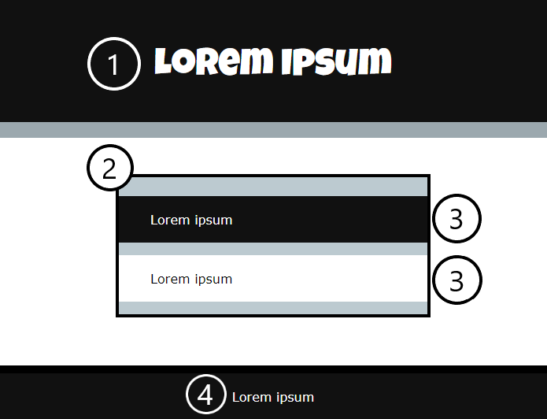
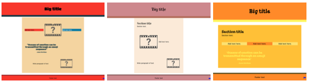

## Structure your page

[[[web-add-title-head]]]

[[[overall-page-structure]]]

[[[full-width-section]]]

[[[full-width-quote]]]

Webpages can be viewed on many different devices and should be **responsive** to each device. This means that if a user views your site on a mobile phone, it should respond to a smaller screen and if they view it on a desktop PC it should respond to a larger screen. 

[[[using-rem]]]

CSS can also be used to responsively change the layout of the page. 

[[[side-by-side-section]]]

[[[wrapped-regular-width]]]

[[[wrapped-wide-narrow]]]

[[[web-large-text-tiles]]]

[[[text-image-text]]]

[[[web-wrap-gap]]]

[[[three-text-tiles]]]

Add more style to any elements on your webpage.

[[[rounded-corners]]]

[[[web-borders]]]

[[[web-box-shadow]]]

[[[add-a-gradient]]]

Align and space your content to improve the look of your webpage.

[[[web-x-y-centering]]]

[[[padding-margins]]]

You can create your own class to make a new style.

[[[web-add-class]]]

