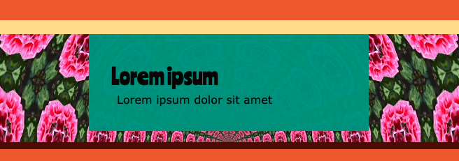

## Insert images

Insert an image from the starter project library:

[[[trinket-image-library]]]

[[[web-alt-text]]]

Use an emoji as an image:

[[[choose-an-emoji]]]

[[[huge-emoji]]]

Add a background image:

[[[web-background-image]]]

[[[add-transparency]]]

**Tip:** You can style your images with rounded corners or borders:

[[[rounded-corners]]]

[[[web-borders]]]

[[[web-box-shadow]]]

You can create your own class to make a new style:

[[[web-add-class]]]

