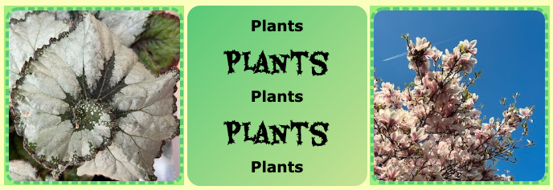

## Structurer ta page

[[[web-add-title-head]]]

[[[overall-page-structure]]]

[[[full-width-section]]]

[[[full-width-quote]]]

Les pages web peuvent être consultées sur de nombreux appareils différents et doivent être **réactives** pour chaque appareil. Cela signifie que si un utilisateur consulte ton site sur un téléphone portable, la page web doit s'adapter à un écran plus petit. Si un utilisateur la consulte sur un ordinateur de bureau, la page web doit s'adapter à un écran plus grand. 

[[[using-rem]]]

CSS peut également être utilisé pour modifier de manière réactive la mise en page de la page :

[[[side-by-side-section]]]

[[[wrapped-regular-width]]]

[[[wrapped-wide-narrow]]]

[[[web-large-text-tiles]]]

[[[text-image-text]]]

[[[web-wrap-gap]]]

[[[three-text-tiles]]]

Tu peux donner plus de style à n'importe quel élément de ta page web :

[[[rounded-corners]]]

[[[web-borders]]]

[[[web-box-shadow]]]

[[[add-a-gradient]]]

Tu peux aligner et espacer ton contenu pour améliorer l'apparence de ta page web :

[[[web-x-y-centering]]]

[[[padding-margins]]]

Tu peux créer ta propre classe pour créer un nouveau style :

[[[web-add-class]]]
