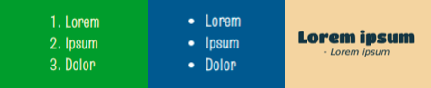

## Ajouter des polices et des éléments texte

Choisis les polices à utiliser sur ta page web.

[[[included-fonts]]]

[[[web-fonts]]]

[[[google-fonts]]]

Tu peux utiliser un texte de remplacement pendant que tu travailles sur ta mise en page :

[[[add-placeholder-text]]]

Tu peux insérer des éléments texte :

[[[web-ordered-list]]]

[[[web-unordered-list]]]

[[[web-create-link]]]

[[[full-width-quote]]]

Tu peux donner un style à ton texte :

[[[web-headers-large-text]]]

[[[web-center-text]]]

[[[web-strong-em]]]

[[[web-animate-span]]]

Tu peux créer ta propre classe pour créer un nouveau style :

[[[web-add-class]]]
