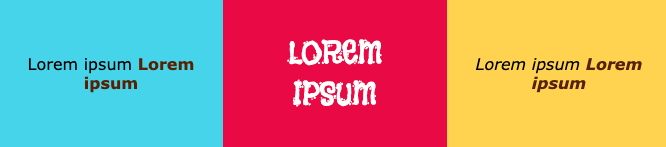

## Ajouter des polices et des éléments texte

Choisis les polices à utiliser sur ta page web.

[[[included-fonts]]]

[[[web-fonts]]]

[[[google-fonts]]]

You can use placeholder text while you work on your layout:

[[[add-placeholder-text]]]

You can insert text elements:

[[[web-ordered-list]]]

[[[web-unordered-list]]]

[[[web-create-link]]]

[[[full-width-quote]]]

You can style your text:

[[[web-headers-large-text]]]

[[[web-center-text]]]

[[[web-strong-em]]]

[[[web-animate-span]]]

You can create your own class to make a new style:

[[[web-add-class]]]
