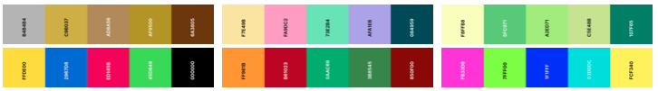
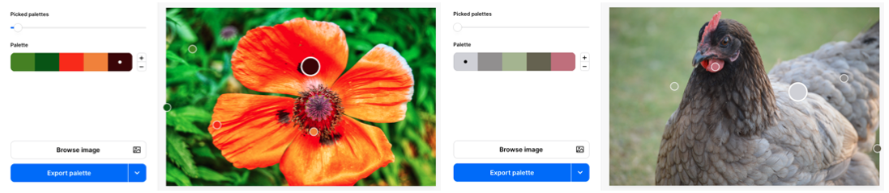

## Kleurenpaletten gebruiken

Wanneer je een webpagina ontwerpt, is het een goed idee om een kleurenpalet te gebruiken.

Met kleurenpaletten kun je een webpagina aantrekkelijker maken met kleuren die goed bij elkaar passen.

[[[web-colour-palette-variables]]]

Je kunt de kleurenpaletten van het webontwikkelingsstartproject gebruiken of personaliseren:

[[[hex-colour-palettes]]]

[[[web-colour-palette]]]

Je kunt een kleurenpalet maken van een afbeelding:

[[[trinket-image-library]]]

[[[colours-from-image]]]

Je kunt kleurenpaletten aanpassen voor stijl en toegankelijkheid:

[[[contrast-checker]]]

[[[add-colour-variables]]]

Je kunt je kleurenpaletten gebruiken om tekst- en achtergrondkleuren in te stellen:

[[[web-primary-secondary]]]

Je kunt je eigen klasse maken om een nieuwe stijl te maken:

[[[web-add-class]]]
