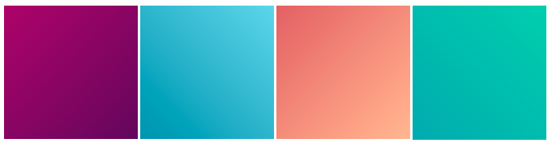

## Structureer je pagina

[[[web-add-title-head]]]

[[[overall-page-structure]]]

[[[full-width-section]]]

[[[full-width-quote]]]

Webpagina's kunnen op veel verschillende apparaten worden bekeken en moeten **responsief** zijn voor elk apparaat. Dit betekent dat als een gebruiker jouw site op een mobiele telefoon bekijkt, de webpagina moet reageren op een kleiner scherm. Als een gebruiker het op een desktop-PC bekijkt, moet de webpagina op een groter scherm reageren. 

[[[using-rem]]]

CSS kan ook worden gebruikt om op responsieve wijze de lay-out van de pagina te veranderen:

[[[side-by-side-section]]]

[[[wrapped-regular-width]]]

[[[wrapped-wide-narrow]]]

[[[web-large-text-tiles]]]

[[[text-image-text]]]

[[[web-wrap-gap]]]

[[[three-text-tiles]]]

Je kunt meer stijl toevoegen aan alle elementen op je webpagina:

[[[rounded-corners]]]

[[[web-borders]]]

[[[web-box-shadow]]]

[[[add-a-gradient]]]

Je kunt je inhoud uitlijnen en meer ruimte geven om het uiterlijk van jouw webpagina te verbeteren:

[[[web-x-y-centering]]]

[[[padding-margins]]]

Je kunt je eigen klasse maken om een nieuwe stijl te maken:

[[[web-add-class]]]
