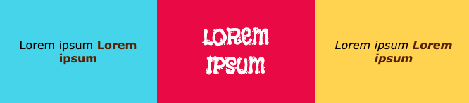

## Lettertypen en tekstelementen toevoegen

Kies lettertypen om te gebruiken op je webpagina.

[[[included-fonts]]]

[[[web-fonts]]]

[[[google-fonts]]]

Je kunt tijdelijke tekst gebruiken terwijl je aan jouw lay-out werkt:

[[[add-placeholder-text]]]

Je kunt tekstelementen invoegen:

[[[web-ordered-list]]]

[[[web-unordered-list]]]

[[[web-create-link]]]

[[[full-width-quote]]]

Je kunt je tekst opmaken:

[[[web-headers-large-text]]]

[[[web-center-text]]]

[[[web-strong-em]]]

[[[web-animate-span]]]

Je kunt je eigen klasse maken om een nieuwe stijl te maken:

[[[web-add-class]]]
