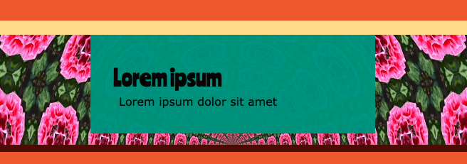

## Afbeeldingen toevoegen

Je kunt een afbeelding uit de startprojectbibliotheek toevoegen:

[[[trinket-image-library]]]

[[[web-alt-text]]]

Je kunt een emoji als afbeelding gebruiken:

[[[choose-an-emoji]]]

[[[huge-emoji]]]

Je kunt een achtergrondafbeelding toevoegen:

[[[web-background-image]]]

[[[add-transparency]]]

**Tip:** Je kunt je afbeeldingen vormgeven met afgeronde hoeken of randen:

[[[rounded-corners]]]

[[[web-borders]]]

[[[web-box-shadow]]]

Je kunt je eigen klasse maken om een nieuwe stijl te maken:

[[[web-add-class]]]
